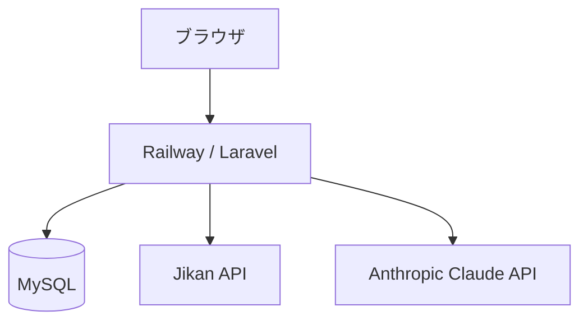

# 漫画コンパス (MangaCompass)

## アプリ概要

2010年代後半から、漫画は紙媒体だけでなくアプリなどでも気軽に読めるようになりました。  
娯楽に事欠かなくなった反面、**媒体が多すぎて漫画探しに疲れていませんか？**

このアプリは、そんな「漫画は好きだけど、探すのがめんどくさい」という人のために作りました。  
検索機能とAIおすすめ機能を組み合わせることで、あなたにぴったりの漫画をナビゲートします。

また、自分の好きなものをあまり人に知られたくないという人も多いと考え、  
**ユーザー同士の接触を極力排除**しました。人目を気にせず、好きな漫画を探してみてください。

🔗 **URL**: https://manga-app-production.up.railway.app

---

## テストアカウント
### メールアドレス

```
test@example.com
```

### パスワード

```
password123
```

---

## 使用技術

| カテゴリ | 技術 |
|------|------|
| バックエンド | PHP 8.4 / Laravel 12 |
| フロントエンド | Blade / Tailwind CSS / Vite |
| データベース | MySQL |
| 外部API | Jikan API（漫画データ取得） |
| AI | Anthropic Claude API（AIおすすめ機能） |
| インフラ | Railway |
| バージョン管理 | GitHub |

---

## システム構成図



---

## 機能一覧

- **漫画検索** - タイトルで漫画を検索。スコアや巻数、あらすじなど詳細情報を確認できる
- **ブックマーク** - お気に入りや読みたいリストに登録して管理できる
- **レビュー** - 読んだ漫画に星評価とコメントを残せる
- **マイページ** - ブックマークとレビューを一覧で確認できる
- **AIおすすめ** - 読みたい雰囲気を自由に入力するだけで、AIがぴったりの漫画を提案する
- **ユーザー認証** - 新規登録・ログイン・ログアウト

---

## ローカル環境構築手順

```bash
# リポジトリをクローン
git clone https://github.com/luckylundy/manga-app.git
cd manga-app

# 環境変数ファイルを作成
cp .env.example .env

# .envを編集（DB設定・APIキーを設定）
# DB_CONNECTION=sqlite
# ANTHROPIC_API_KEY=your_api_key

# パッケージインストール
composer install
npm install

# アプリケーションキー生成
php artisan key:generate

# マイグレーション実行
php artisan migrate

# フロントエンドビルド
npm run build

# サーバー起動
php artisan serve
```

ブラウザで `http://localhost:8000` にアクセス

---

## 工夫した点・苦労した点

### AIおすすめ機能の表示設計
Claude APIからの回答をそのまま表示するのではなく、**JSONフォーマットで出力させる**ように設計しました。  
「イントロ文」と「漫画ごとのおすすめ理由」を分離することで、読みやすくおしゃれなUIを実現しました。

### 外部APIからのデータ取得
[Jikan API（MyAnimeListの非公式API）](https://docs.api.jikan.moe/)を使い、8万冊以上の漫画データを取得しています。  
APIのレスポンス構造を理解し、必要なデータのみ抽出する設計を行いました。

### 統一感のあるUI設計
インディゴ〜パープルのグラデーションをアプリ全体のメインカラーとして採用し、  
ナビゲーションロゴ・ヒーローセクション・AIボタンなど各所で統一感を意識しました。

---

## 今後の改善予定

- ~~レスポンシブデザインのさらなる最適化~~(2026/03/07済)
- ~~テストコードの追加（PHPUnit / Pest）~~(2026/03/09済)
- ~~Docker化による環境構築の簡易化~~(2026/03/09済)
- GitHub ActionsによるCI/CD構築
- React.jsかVue.jsでのフロントエンド実装
- ジャンルごとのランキング表示
- AI検索で出てきた漫画の詳細ページに遷移できる機能
- 該当の漫画がどの媒体(ジャンプ+、サンデーなど)で読めるかの表示
- 協調フィルタリングによる、「お気に入り」「読みたい」の傾向を反映したおすすめ漫画表示機能
